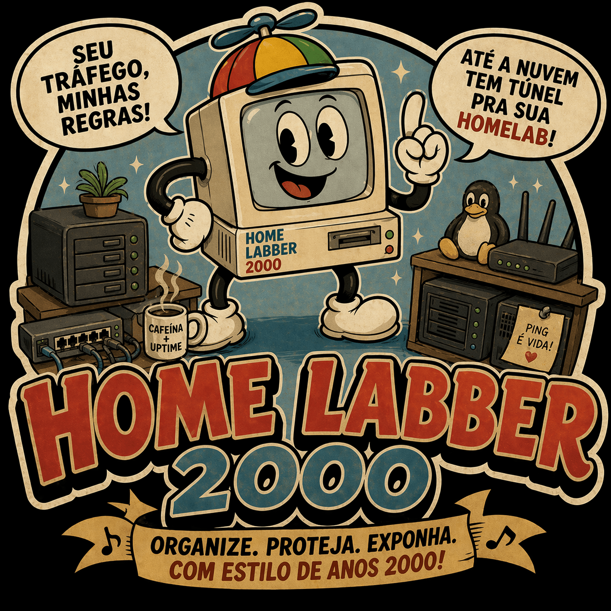

  

  <h1>home-lab-machine-syncer</h1>

  

    <strong>Config-driven homelab publication sync for Caddy and local DNS.</strong>
  

  

    
    
    
    
    
  

  

    <em>Organize. Protect. Expose. With homelab energy from the 2000s.</em>
  

